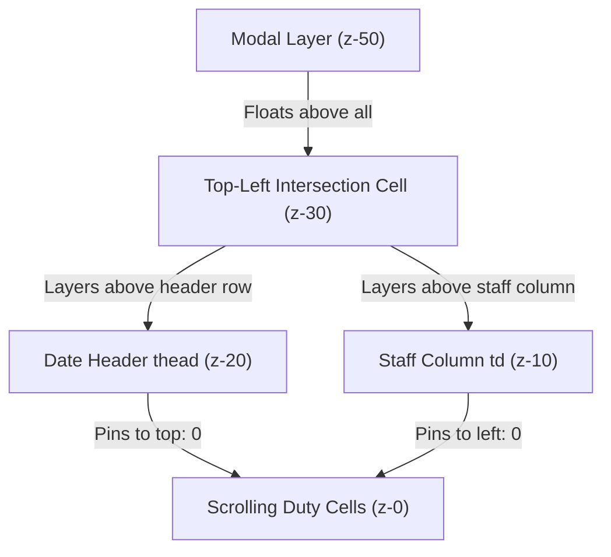

# Major Update — Phase 8 Slice 1: Desktop Roster Workspace Refinement

**Branch**: `feature/phase-7-goff-ledger` (or Phase 8 lineage)  
**Status**: `PHASE_8_SLICE_1_CERTIFIED`  
**Execution Context**: Strict Development Quarantine (Zero Merge to `main`, Zero Production Deployment, Zero Sheet Mutation)  
**Test Suite**: `npm test` — **819 passed, 0 failed, 0 skipped** across all test suites

---

## 1. Executive Summary

Phase 8 Slice 1 elevates the authoritative roster workspace on desktop and wide screens from a mobile-constrained view into a dense, scannable clinical scheduling environment.

Prior to this slice, the roster interface suffered from significant desktop pain points:
- The entire page was constrained to a generic `max-w-5xl` container, leaving wide desktop displays (1280px–1920px) underutilized with vast blank margins.
- Date header rows disappeared off the top of the viewport when scrolling vertically past row 5 of doctor assignments.
- Weekdays were absent from headers (only displaying numbers `01` to `31`), forcing staff to check external calendars to identify weekends and gazetted public holidays.
- Cells had excessive padding and vertically stacked buttons, causing row heights to balloon up to 70px–90px per person.
- The toolbar controls were fragmented into multiple stacked rows, consuming ~250px of vertical space before duty rows began.

Slice 1 resolves these ergonomics challenges cleanly without changing any backend contracts, domain models, or mobile touch behavior.

---

## 2. Desktop UX Audit Findings & Corrective Architecture

| Audit Area | Pre-Phase 8 Behavior | Phase 8 Slice 1 Desktop Enhancement |
| :--- | :--- | :--- |
| **Container Width** | Constrained to `max-w-5xl` (1024px) | Expands to `w-full max-w-none` when authoritative V2 workspace is active on desktop screens. |
| **Date Header Visibility** | Unpinned; scrolled out of view vertically | Pinned via `sticky top-0 z-20` on `thead` within bounded viewport `.roster-scroll-viewport`. |
| **Doctor Column Visibility** | Pinned without distinct boundary (`z-10`) | Pinned via `sticky left-0 z-10` with elevation border/shadow (`shadow-[2px_0_4px_-2px_rgba(0,0,0,0.06)]`). |
| **Top-Left Intersection** | Collided with date headers during vertical scroll | Pinned dual-axis via `sticky left-0 top-0 z-30 bg-slate-50 border-r border-b border-slate-200`. |
| **Modal Layering** | Potential collision with sticky headers | Modals strictly elevated at `fixed inset-0 z-50`, floating unobstructed above `z-30` intersection. |
| **Weekday Identification** | Numeric day only (`01`, `02`...) | Added uppercase weekday labels (`Mon`, `Sat`, `Sun`) computed statically per month. |
| **Weekend Highlighting** | Indistinguishable from weekdays | Subtle weekend shading (`bg-slate-100/90` on header, `bg-slate-50/40` on duty cells) and `data-is-weekend="true"`. |
| **Public Holiday Indication** | Only inferred if doctor had `HKA` | Gazetted Selangor public holidays highlighted with `PH` badge, tooltip name, and rose tint (`bg-rose-50`). |
| **Today Anchor** | No visual anchor for current day | Current day prominently badged with `Today` pill, indigo ring, and highlighted column (`data-is-today="true"`). |
| **Cell Density** | Bulky cells (`min-w-[65px]`, `min-h-[44px]`) | Compact high-density cells (`min-w-[46px] lg:min-w-[48px]`, `min-h-[36px] lg:min-h-[38px]`). |
| **Planned vs Current Visibility** | Only badge "Changed" without comparison | Enhanced with inline comparison: `Changed (OFF→AM)` and rich hover tooltip. |
| **Toolbar Consolidation** | Fragmented across 3 vertical tiers | Consolidated into a streamlined horizontal toolbar (`#roster-toolbar-header`) on desktop. |
| **Focus Mode** | Non-existent | Lightweight client-side focus toggle (`🗖 Focus Mode` / `🗗 Exit Focus`) to collapse guidance chrome and expand grid. |
| **Accessibility** | Minimal label on duty cells | Structured `aria-label`s combining Doctor Name, Date, Shift Code, Coverage Details, and Amendment status. |

---

## 3. Layering & Sticky Architecture

The table employs strict CSS stacking context separation to prevent flicker and overlap during dual-axis scrolling:

- **Top-Left Intersection (`<th> Doctor / Staff`)**: `sticky left-0 top-0 z-30`
- **Date Header Row (`<thead>`)**: `sticky top-0 z-20`
- **Frozen Doctor / Staff Column (`<td>`)**: `sticky left-0 z-10`
- **Duty Cells (`<td>`)**: Natural scroll flow (`z-0`)
- **Modals (`AmendmentModal`, `AbsenceModal`, etc.)**: `fixed inset-0 z-50`

---

## 4. Performance Audit & Optimization

Before implementing, rendering performance was inspected for a representative month (25 doctors × 31 days = 775 cells):
1. **Memoized Date Metadata (`dateMetaMap`)**:
   Instead of parsing dates and querying `getHolidayName(d)` 775 times per render loop inside cell components, date metadata (day of week, weekday abbreviation, weekend boolean, holiday name boolean, and today boolean) is computed exactly once per period inside `useMemo`.
2. **DOM Element Count**:
   At 775 cells, the virtual DOM footprint is lightweight (< 1,800 elements). Native browser rendering easily operates at 60 FPS without external virtualization libraries (`react-window` / `react-virtualized`), avoiding premature complexity while maintaining crisp scroll performance.
3. **Pure Presentation Enhancements**:
   No new fetch requests, state stores, or async pollers were introduced.

---

## 5. Mobile & Tablet Preservation

Responsive design strictly protects smaller viewports:
- **Phone (~390px)**: Desktop focus button is hidden (`hidden lg:inline-flex`); standard mobile card stacking remains active; horizontal scrollbar allows natural swiping without page-level blowout.
- **Tablet (~768px)**: Flexible grid with responsive touch-friendly targets (`min-h-[44px]`).
- **Laptop & Desktop (>= 1024px)**: Full high-density layout activates with sticky dual-axis headers and expanded available width.
- **Wide Screens (1440px+)**: Container expands to available viewport width (`w-full max-w-none`).

---

## 6. Complete Verification & Regression Accounting

| Test Suite | Pass Count | Fail Count | Description |
| :--- | :---: | :---: | :--- |
| `test:legacy` | 5 | 0 | Adapters, cache, quota, holidays, leaveTracking |
| `test:phase1` | 95 | 0 | Contract schemas, build verification, backend harness |
| `test:phase2` | 72 | 0 | Queue engine, idempotency, storage, retry mechanisms |
| `test:phase3` | 76 | 0 | Conflict detection, audit logging, schema validation |
| `test:phase4` | 91 | 0 | Lifecycle state machine, publishing, closing, reopening |
| `test:phase5` | 132 | 0 | Authoritative working roster, amendments, swaps, 10s undo |
| `test:phase6` | 130 | 0 | Operational absences, replacement workflows, lineages |
| `test:phase7` | 176 | 0 | Medical officer GOFF/GHKA compensating ledger, recovery |
| `test:phase8` | 47 | 0 | Desktop workspace, sticky headers, density, responsiveness |
| **Total** | **819** | **0** | **Complete Zero-Failure Repository Certification** |

### Build Artifact Verification
- `node scripts/build-appscript.mjs --check`: Passed cleanly.
- `npm run build`: Vite build completed cleanly in 14.80s.
- `git status --porcelain dist/index.html`: Clean, zero artifact drift.
- `git diff --check`: Clean.

---

## 7. Production Separation Status

Phase 8 remains strictly isolated within development:
- **`main` / `origin/main`**: Unmodified at `17712a4f7e177771ff3cf44d02d7ba570f567d21`.
- **`origin/gh-pages`**: Unmodified at `4ec7843` (May 20, 2026).
- **Google Apps Script**: Zero code pushed to live script deployments.
- **Google Sheets**: Zero production sheets touched; all execution isolated in mock harnesses.
