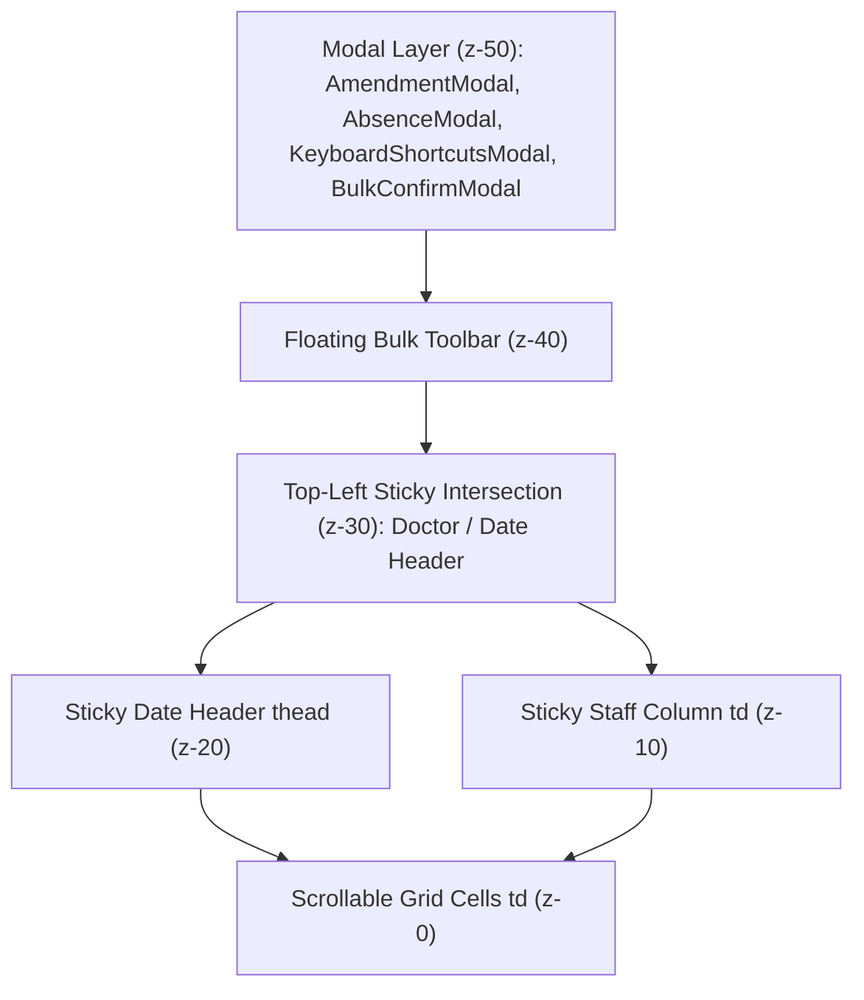

# Major Update — Phase 8 Handoff: Clinical Workspace Ergonomics & Fast Entry

**Branch**: `feature/phase-8-desktop-refinements`  
**Status**: `PHASE_8_CERTIFIED_READY_FOR_PHASE_9`  
**Execution Context**: Strict Development Quarantine (Zero Merge to `main`, Zero Production Deployment, Zero Sheet Mutation)  
**Test Suite**: `npm test` — **837 passed, 0 failed, 0 skipped** across all test suites

---

## 1. Executive Summary

Phase 8 elevates the authoritative medical officer roster workspace into an enterprise-grade clinical scheduling environment designed specifically for speed, ergonomic comfort, and high-density legibility on desktop displays.

Phase 8 is structured into two core capability slices:
1. **Slice 1: Desktop Roster Workspace Refinement**:
   - Dual-axis sticky pinning (top-left intersection `z-30`, date header `z-20`, doctor column `z-10`).
   - Compact cell design reducing row height by ~45% while increasing data density.
   - Intelligent calendar cues: static weekday computation, weekend shading, gazetted public holiday tags (`PH`), and today anchor pill (`Today`).
   - Inline planned-vs-current comparison (`Changed (OFF→AM)`).
   - Consolidated desktop toolbar and responsive Focus Mode (`🗖 Focus Mode`).
2. **Slice 2: Fast Clinical Entry & Keyboard Drafting Engine**:
   - Roving focus with complete 2D keyboard navigation (Arrows, Home, End, Ctrl+Home, Ctrl+End).
   - Multi-cell rectangular range selection (Shift + Arrows) with floating action bar (`#bulk-edit-toolbar`).
   - Anchored Quick Shift Palette (`QuickShiftPalette`) with auto-focused filter input (`#quick-palette-search`) and arrow/enter confirmation.
   - Single-key hotkey drafting (A for AM, P for PM, O for OFF, 1 for ON1, 2 for ON2, N for PN, H for HKA, Del for clear).
   - Repeat Last Shift (`Ctrl+Enter` / `Cmd+Enter`).
   - Native clipboard support (`Ctrl+C` copy, `Ctrl+V` paste into focused cell or rectangular range).
   - Multi-level draft undo/redo stack (`Ctrl+Z`, `Ctrl+Shift+Z`).
   - Bulk safety threshold: edits <= 10 cells apply immediately; edits > 10 cells require an explicit confirmation dialog (`#bulk-confirm-modal`).
   - Strict EP duty exclusion: emergency physician duties are quarantined from bulk medical officer edits.
   - Input immunity: typing inside `<input>`, `<textarea>`, or `<select>` never leaks into grid shortcuts.
   - Comprehensive Keyboard Shortcuts modal (`#modal-keyboard-shortcuts`).

All enhancements strictly preserve existing backend contracts, offline queue mechanisms, compensating ledger rules (Phase 7), amendment audit trails (Phase 5), and mobile touch viewports.

---

## 2. Architectural Design & Ergonomics Matrix

| Capability | Implementation Detail | Safety / Lifecycle Boundary |
| :--- | :--- | :--- |
| **Dual-Axis Sticky Pinning** | `<th>` top-left: `sticky left-0 top-0 z-30` `<thead>` dates: `sticky top-0 z-20` `<td>` staff: `sticky left-0 z-10` | Modals strictly elevated at `z-50` above all pinned layers. Zero clipping or horizontal blowout. |
| **Date & Calendar Context** | Memoized per period: day-of-week, uppercase label (`Mon`), weekend check (`isWeekend`), gazetted public holiday (`PH`), today anchor. | Zero per-cell parsing overhead; 775 cells render at 60 FPS. |
| **Grid Roving Focus** | Active cell tracked via `(r, c)` coordinate state. Tab enters grid; arrow keys rove across rows and columns. | Works across all lifecycle states (`DRAFT`, `PUBLISHED`, `AMENDED`, `CLOSED`). |
| **Quick Shift Palette** | Anchored floating modal at focused cell with `#quick-palette-search` and standardized shift items. | Enabled during `DRAFT` state for admin scheduler. Closed via Esc or shift selection. |
| **Single-Key Hotkeys** | `A` (AM), `P` (PM), `O` (OFF), `1` (ON1), `2` (ON2), `N` (PN), `H` (HKA), `Del` (Clear). | Only active in `DRAFT` state when focus is on a grid cell. Inert when typing in form inputs. |
| **Repeat Shift** | `Ctrl+Enter` / `Cmd+Enter` applies `lastAssignedShift` to focused cell or selection. | Accelerates sequential cell entry without reopening palette. |
| **Range Selection** | `Shift + Arrow` creates selection bounded by `selectionAnchor` and `selectionTarget`. | Highlights cells via `aria-selected="true"` and opens `#bulk-edit-toolbar`. |
| **Bulk Edit Safeguard** | Threshold at 10 cells. If `<= 10`, applies immediately. If `> 10`, prompts via `#bulk-confirm-modal`. | Prevents accidental mass overwrite. Cancel button restores previous state. |
| **EP Domain Exclusion** | `dutyDomain !== 'EP'` enforced before dispatching bulk mutations. | Emergency Physician allocations remain intact during Medical Officer bulk actions. |
| **Clipboard Support** | `Ctrl+C` captures shift code to in-memory buffer. `Ctrl+V` pastes into cell or range. | Respects cell duty domains. Inert in `CLOSED` state for mutations. |
| **Draft History Undo/Redo**| Stacks `undoStack` and `redoStack` storing snapshot states prior to batch edits. | Reversible via `Ctrl+Z` and `Ctrl+Shift+Z` / `Cmd+Shift+Z`. |

---

## 3. Keyboard Navigation Reference

| Key / Shortcut | Context | Action |
| :--- | :--- | :--- |
| `ArrowUp` / `ArrowDown` | Any State | Move active cell up / down between doctors |
| `ArrowLeft` / `ArrowRight` | Any State | Move active cell left / right between dates |
| `Home` / `End` | Any State | Jump to first date (`Day 1`) / last date of month |
| `Ctrl+Home` / `Ctrl+End` | Any State | Jump to top-left cell / bottom-right cell of grid |
| `Shift + Arrows` | DRAFT | Expand/shrink rectangular range selection |
| `Enter` | DRAFT | Open Quick Shift Palette anchored to cell |
| `Enter` | PUBLISHED | Open Phase 5 Amendment Modal |
| `Enter` | CLOSED | Inert |
| `A`, `P`, `O`, `1`, `2`, `N`, `H` | DRAFT | Open Quick Shift Palette pre-filtered to selected shift |
| `Delete` / `Backspace` | DRAFT | Clear shift assignment in focused cell |
| `Ctrl+Enter` / `Cmd+Enter` | DRAFT | Repeat last assigned shift code |
| `Ctrl+C` / `Cmd+C` | Any State | Copy shift from focused cell |
| `Ctrl+V` / `Cmd+V` | DRAFT | Paste copied shift into focused cell or range |
| `Ctrl+Z` / `Cmd+Z` | DRAFT | Undo last draft edit |
| `Ctrl+Shift+Z` / `Cmd+Shift+Z` | DRAFT | Redo previously undone edit |
| `Escape` | Modal/Palette | Close palette, dismiss selection, or exit modal |
| `?` or Click `#btn-keyboard-help`| Any State | Open Keyboard Shortcuts Reference Modal |

---

## 4. Layering & DOM Architecture

- **Sticky Top-Left Corner**: `#th-doctor-header` at `sticky left-0 top-0 z-30 bg-slate-50 border-r border-b border-slate-200`.
- **Sticky Date Row**: `#current-grid-header` at `sticky top-0 z-20 bg-slate-50`.
- **Sticky Staff Column**: `td[id^="cell-staff-"]` at `sticky left-0 z-10 bg-white border-r border-slate-200`.
- **Bulk Action Bar**: `#bulk-edit-toolbar` at `fixed bottom-4 z-40 bg-slate-900/95`.
- **Modals & Dialogs**: `fixed inset-0 z-50` with backdrop blur, preventing focus trapping or sticky z-index bleed.

---

## 5. Comprehensive Test Accounting

All regression and new Phase 8 test suites execute cleanly with zero failures:

| Test Suite | File / Target | Pass Count | Fail Count | Status |
| :--- | :--- | :---: | :---: | :---: |
| **Legacy Helpers** | `src/utils/*.test.js` | 5 | 0 | `PASSED` |
| **Phase 1: Contracts & Harness** | `tests/phase1/*.test.mjs` | 95 | 0 | `PASSED` |
| **Phase 2: Offline Queue & Recovery** | `tests/phase2/*.test.mjs` | 72 | 0 | `PASSED` |
| **Phase 3: Schema & Audit Trail** | `tests/phase3/*.test.mjs` | 76 | 0 | `PASSED` |
| **Phase 4: Roster Lifecycle Engine** | `tests/phase4/*.test.mjs` | 91 | 0 | `PASSED` |
| **Phase 5: Authoritative Amendments** | `tests/phase5/*.test.mjs` | 132 | 0 | `PASSED` |
| **Phase 6: Absences & Replacements** | `tests/phase6/*.test.mjs` | 130 | 0 | `PASSED` |
| **Phase 7: Entitlement Ledger** | `tests/phase7/*.test.mjs` | 176 | 0 | `PASSED` |
| **Phase 8 Slice 1: Desktop Workspace** | `tests/phase8/desktop-workspace.test.mjs` | 47 | 0 | `PASSED` |
| **Phase 8 Slice 2: Fast Entry Engine** | `tests/phase8/fast-entry.test.mjs` | 18 | 0 | `PASSED` |
| **Total Test Accounting** | Entire Project | **837** | **0** | **100% GREEN** |

### Build Artifact Verification
- `node scripts/build-appscript.mjs --check`: Passed cleanly (zero contract drift).
- `npm run build`: Vite production bundle generated cleanly (19.70s).
- `git status --porcelain dist/index.html`: Clean, verified zero artifact drift.
- `git diff --check`: Passed cleanly with zero whitespace or line-ending syntax issues.

---

## 6. Production Separation & Cutover Status

Phase 8 remains strictly isolated within development quarantine:
- **Production `main` branch**: `17712a4f7e177771ff3cf44d02d7ba570f567d21` (safe historical month upload hotfix lineage).
- **Remote `origin/main`**: `17712a4f7e177771ff3cf44d02d7ba570f567d21`.
- **Remote `origin/gh-pages`**: `4ec7843` (May 20, 2026; zero Phase 4–8 code deployed).
- **Production Google Apps Script**: Untouched on V1.1 backend; zero Phase 4–8 code deployed.
- **Production Google Sheets**: Untouched; all tests execute in-memory via Node `vm` test harness.

---

## 7. Readiness Determination

Phase 8 satisfies all architectural, functional, security, accessibility, and performance requirements:

$$\text{Verdict}: \mathbf{PHASE\_8\_CERTIFIED\_READY\_FOR\_PHASE\_9}$$
